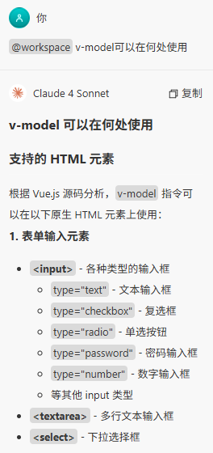
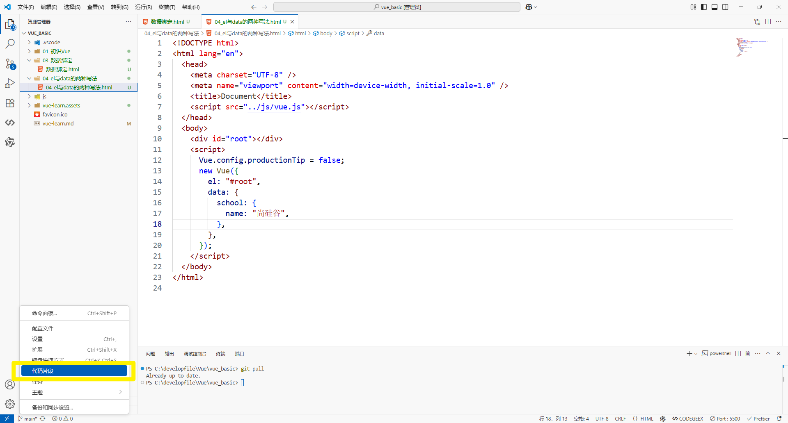
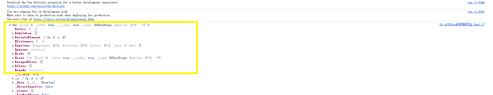

# Vue学习

# 安装Vue devtools

[vuejs/devtools-v6 at v5.1.1](https://github.com/vuejs/devtools-v6/tree/v5.1.1)

下载源码

vue-devtools-5.1.1安装
安装 :

1. 下载vue-devtools
   https://github.com/vuejs/vue-devtools/tree/v5.1.1.

2. 进入到vue-devtools-5.1.1的根目录下，通过cnpm install安装相关的依赖

3. cnpm run build

4. 修改：shells/chrome/manifest.json中的"persistent": false。将值改为true

5. 打开谷歌浏览器，输入 chrome://extensions/ ，选择开发者模式，加载已解压的扩展程序，选择Chrome导入即可。

6. 重启chrome即可使用

[Chrome 浏览器安装Vue Devtools调试工具 (详细教程) - 呵呵可笑 - 博客园](https://www.cnblogs.com/zsh-blog/p/15067712.html)

## 上方教程不好用

在这下载：[Vue.js devtools 旧版_6.6.4_Chrome插件下载_极简插件](https://chrome.zzzmh.cn/info/iaajmlceplecbljialhhkmedjlpdblhp)

注意版本

7版本的只能用于V3


# 基本知识

## 前端代码格式化插件

prettier - 配置非常简单，保存文件自动格式化

https://blog.csdn.net/m0_64289188/article/details/147110688

# 数据绑定

# v-bind 和 v-model 的区别

## 简洁回答

**v-bind** 实现单向数据绑定，数据从 Vue 实例流向 DOM 元素；**v-model** 实现双向数据绑定，数据可以在 Vue 实例和表单元素之间双向流动。

## 详细分析

### 1. 数据流向差异

#### v-bind（单向绑定）简写`:`
```html
<input type="text" :value="school.name" />
```
- **数据流向**：Vue 实例 → DOM 元素
- **特点**：当 `school.name` 改变时，输入框的值会更新
- **限制**：用户在输入框中输入内容不会影响 `school.name` 的值

#### v-model（双向绑定）简写`v-model,value可以省略`
```html
<input type="text" v-model:value="school.name" />
```
- **数据流向**：Vue 实例 ↔ DOM 元素
- **特点**：既能从数据更新视图，也能从视图更新数据
- **优势**：用户输入会实时同步到 Vue 实例的数据中

### 2. 底层实现机制

#### v-bind 实现原理
从源码 `js/vue.js` 中可以看到，v-bind 通过以下方式工作：
```javascript
// 处理 v-bind 指令
if (bindRE.test(name)) {
    name = name.replace(bindRE, '');
    value = parseFilters(value);
    // 添加属性绑定
    addProp(el, name, value, list[i], isDynamic);
}
```

#### v-model 实现原理
v-model 实际上是语法糖，结合了属性绑定和事件监听：

```javascript
// v-model 的核心实现
function genDefaultModel(el, value, modifiers) {
    var event = lazy ? 'change' : type === 'range' ? RANGE_TOKEN : 'input';
    var valueExpression = '$event.target.value';
    
    var code = genAssignmentCode(value, valueExpression);
    addProp(el, 'value', `(${value})`);
    addHandler(el, event, code, null, true);
}
```

### 3. 适用场景

#### v-bind 适用场景
- **显示数据**：展示计算结果、状态信息
- **动态属性**：根据数据动态设置 class、style、src 等
- **只读展示**：不需要用户交互的数据展示

#### v-model 适用场景
- **表单输入**：input、textarea、select 等表单元素
- **用户交互**：需要收集用户输入的场景
- **实时同步**：需要数据与界面实时同步的情况

### 4. 性能考虑

#### v-bind
- **性能开销较小**：只需要监听数据变化并更新 DOM
- **单向更新**：避免了事件监听的开销

#### v-model
- **性能开销较大**：需要同时处理数据绑定和事件监听
- **双向同步**：涉及更多的监听器和更新逻辑

### 5. 使用建议

1. **默认选择 v-bind**：当只需要显示数据时
2. **表单交互使用 v-model**：当需要收集用户输入时
3. **避免过度使用 v-model**：不必要的双向绑定会影响性能
4. **根据实际需求选择**：明确是否真的需要双向数据流

## 总结

v-bind 和 v-model 的核心区别在于数据流向：v-bind 是单向的数据到视图，而 v-model 是双向的数据与视图同步。选择哪个取决于你的具体需求 - 如果只是展示数据，使用 v-bind；如果需要用户输入并同步数据，使用 v-model。

## v-model可以在何处使用

只能用在表单元素上（输入类元素），有value值的。



`v-model:value`可以简写为`v-model`，因为`v-model`默认收集的就是`value`值

`v-bind`简写为`:`

快捷生成Vue实例化代码



Vue实例查看



所有以`$`开头的都是给程序员用的


